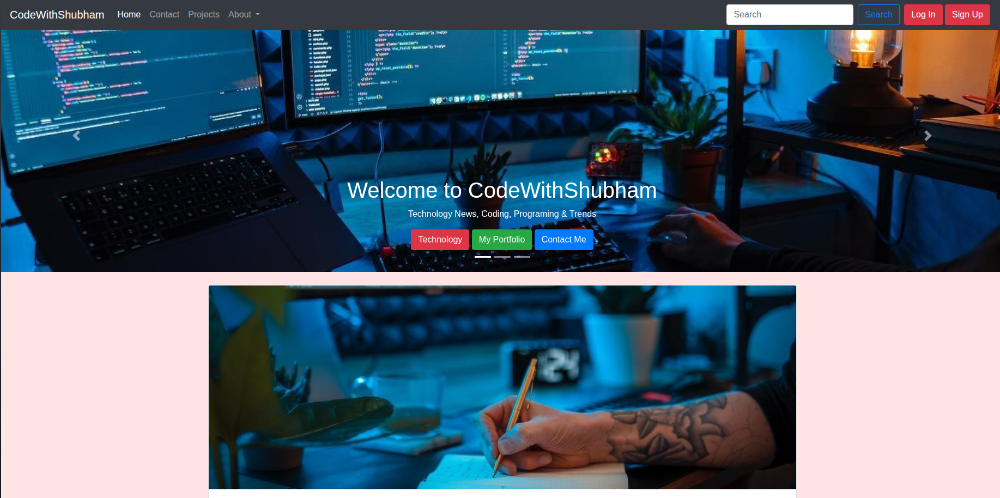
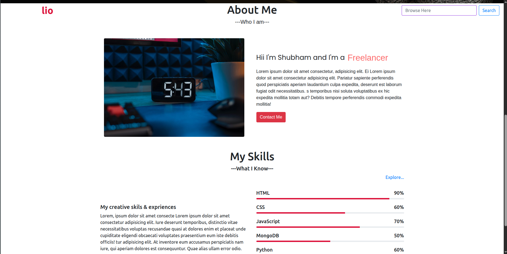
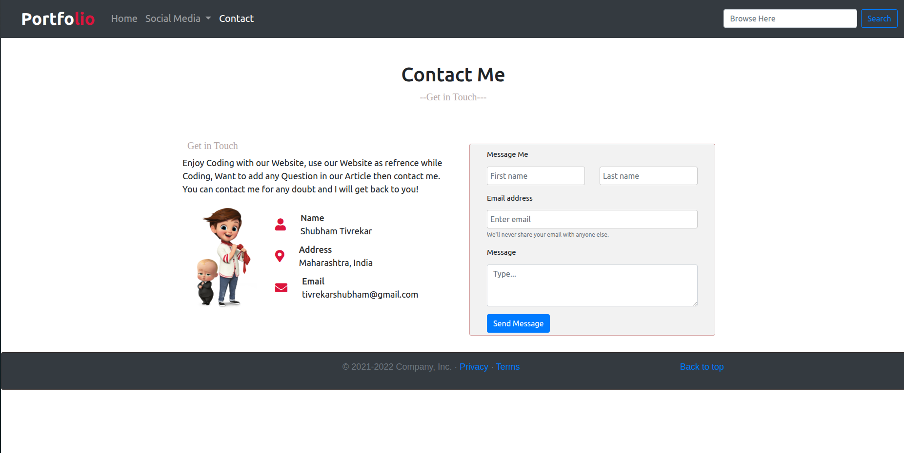

# 🌐 Personal Website (Practice Project)

A simple personal website built as a practice project to learn and implement web development concepts using Node.js, Express.js, Handlebars, HTML, CSS, and JavaScript.

## 🚀 Live Demo

🔗 Live Website: https://personal-website-ktvl.onrender.com

## 📂 GitHub Repository

🔗 Repository: https://github.com/CodeWithShubz/personal-website

---

## 📖 About The Project

This project was created for learning and practice purposes while exploring full-stack web development.

The website includes multiple pages, navigation components, reusable templates, and responsive layouts. It helped me gain hands-on experience with server-side rendering using Handlebars (HBS), routing with Express.js, and deploying applications on Render.

---

## ✨ Features

* Responsive website layout
* Navigation bar and multiple pages
* Handlebars template engine (HBS)
* Reusable partial components
* Express.js routing
* Static asset management
* Deployed on Render

---

## 🛠️ Technologies Used

* HTML5
* CSS3
* JavaScript
* Node.js
* Express.js
* Handlebars (HBS)
* Render

---

## 📸 Screenshots

| Home Page | About Page |
|-----------|------------|
|  |  |

| Portfolio Page | Contact Page |
|---------------|--------------|
|  |  |

---

## 📁 Project Structure

```text
personal-website/
│
├── public/
│   ├── css/
│   ├── js/
│   └── images/
│
├── src/
│   └── app.js
│
├── templates/
│   ├── views/
│   └── partials/
│
├── screenshots/
│   ├── home.png
│   └── about.png
│   └── contact.png
│   └── portfolio.png
│
├── package.json
└── README.md
```

---

## ⚙️ Installation

Clone the repository:

```bash
git clone https://github.com/CodeWithShubz/personal-website.git
```

Move into the project directory:

```bash
cd personal-website
```

Install dependencies:

```bash
npm install
```

Start the application:

```bash
npm start
```

Visit:

```text
http://localhost:8000
```

---

## 🎯 Learning Outcomes

Through this project, I learned:

* Express.js fundamentals
* Server-side rendering with Handlebars
* Routing and template management
* Working with static files
* Deployment using Render
* Basic project structure for Node.js applications

---

## 👨‍💻 Author

**Shubham Tivrekar**

GitHub: https://github.com/CodeWithShubz

---

## ⭐ Acknowledgement

This project was created for educational and practice purposes to improve web development skills.
